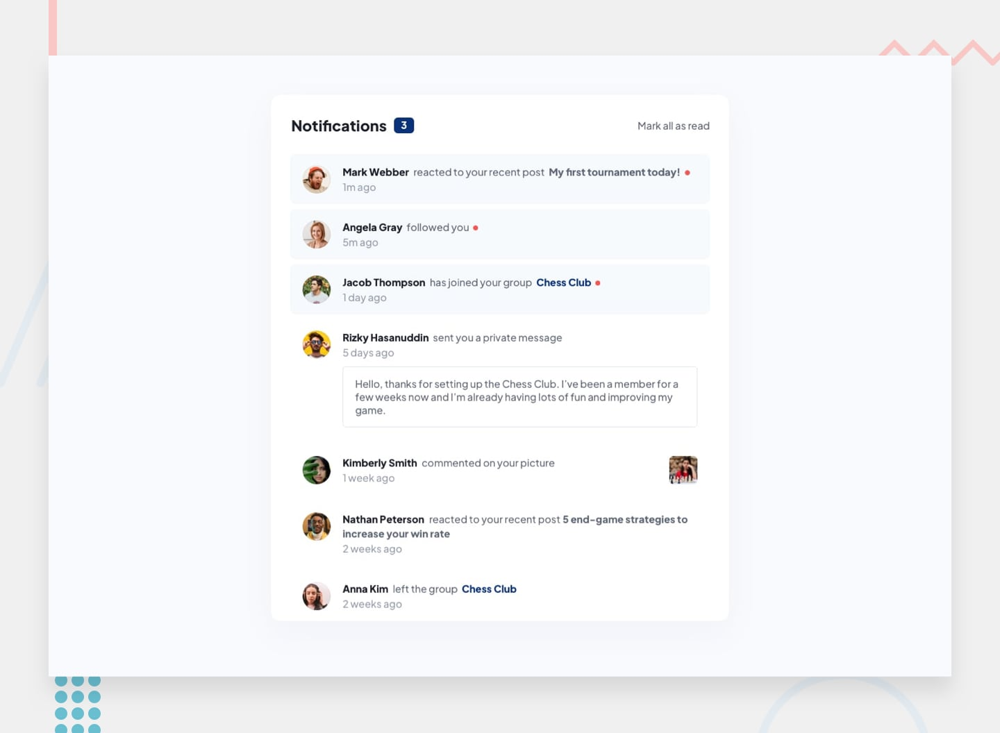

# Frontend Mentor - Notifications page

## The challenge

Your challenge is to build out this notifications page and get it looking as close to the design as possible.

Your users should be able to:

- Distinguish between "unread" and "read" notifications
- Select "Mark all as read" to toggle the visual state of the unread notifications and set the number of unread messages to zero
- View the optimal layout for the interface depending on their device's screen size
- See hover and focus states for all interactive elements on the page
